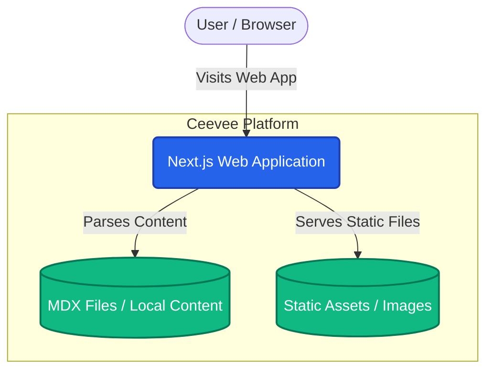

# System Overview Architecture

This document outlines the high-level architecture of the Ceevee application. The application is built as a static site generated or server-side rendered application using Next.js.

## Key Principles
- **Content as Code:** All CV content (experiences, projects) is stored alongside the code using MDX or JSON to keep the app highly portable and version-controlled.
- **Server and Client Separation:** Utilizing React Server Components (where applicable in Next.js) to keep the client bundle size small, prioritizing performance and SEO.

## Context Diagram

