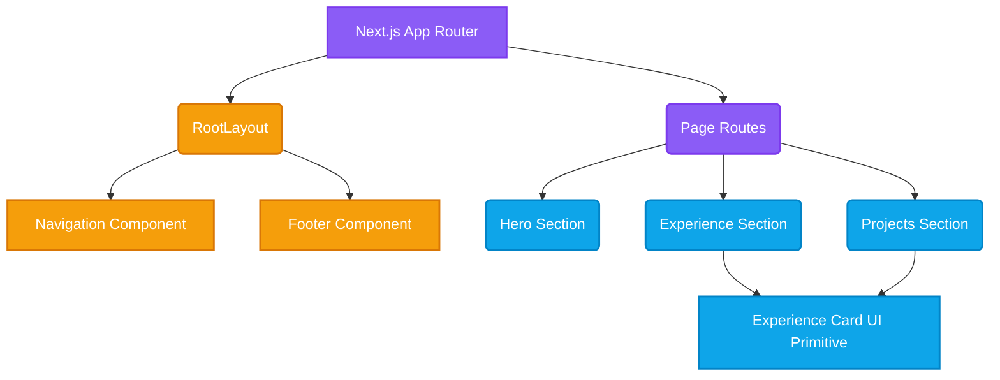

# Frontend Architecture Rules

To maintain a clean and scalable codebase within the Next.js and React ecosystem, the frontend follows specific structural conventions.

## Architecture Rules

1. **Component Hierarchy:** Components should be categorized based on their scope (e.g., UI primitives vs. layout components). Keep state as local as possible.
2. **Server Components by Default:** In the Next.js App Router, components should be Server Components by default to optimize performance. Only add `"use client"` when interactivity (hooks, state, event listeners) is explicitly required.
3. **Styling Consistency:** All styling is managed via Tailwind CSS. Avoid inline styles unless absolutely necessary for dynamic values.
4. **Type Safety:** Strict TypeScript rules apply. No `any` types. All props and state must be explicitly typed.

## Component Flow & Structure

