# Deployment & CI/CD Architecture

Following the DevOps Foundation ADR, Ceevee is containerized using Docker and utilizes GitHub Actions to automate testing and deployment.

## Deployment Rules

1. **Immutable Builds:** Every merge to the `main` branch results in a new, tagged Docker image to ensure immutability and consistent rollbacks.
2. **Automated Validation:** PRs to `main` must pass through the `lint` and `test` pipelines before they can be merged.
3. **Infrastructure as Code (IaC) principles:** Dockerfiles and GitHub Actions YAML files are the sole source of truth for the environment configuration. No manual server interventions should be required.

## CI/CD Pipeline Flow

```mermaid
sequenceDiagram
    participant Dev as Developer
    participant GH as GitHub Repository
    participant Action as GitHub Actions
    participant Registry as Docker Registry
    participant Server as Target Environment

    Dev->>GH: Push / Merge to 'main'
    GH->>Action: Trigger CI/CD Pipeline
    
    rect rgb(30, 41, 59)
    note right of Action: Continuous Integration (CI)
    Action-->>Action: Checkout Code
    Action-->>Action: Setup Node & Install Deps
    Action-->>Action: Run Linter (ESLint / Prettier)
    Action-->>Action: Run Tests
    end
    
    rect rgb(15, 23, 42)
    note right of Action: Continuous Delivery (CD)
    Action->>Action: Build Docker Image
    Action->>Registry: Push Docker Image (Tag: SHA / Latest)
    Action->>Server: Trigger Rollout / Restart Container
    Server-->>Registry: Pull Latest Image
    Server-->>Server: Start New Container
    end
    
    Action->>GH: Post Deployment Status
```

